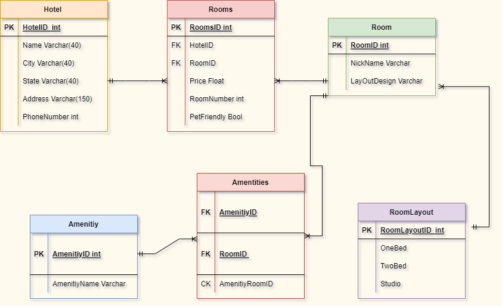
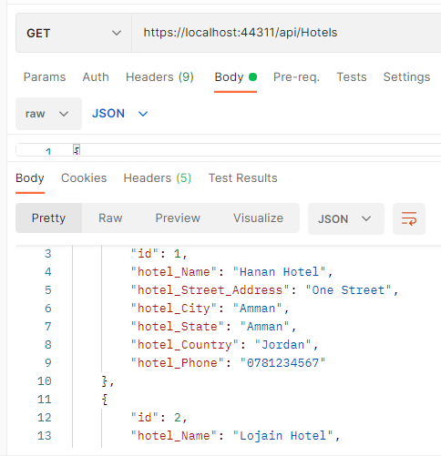
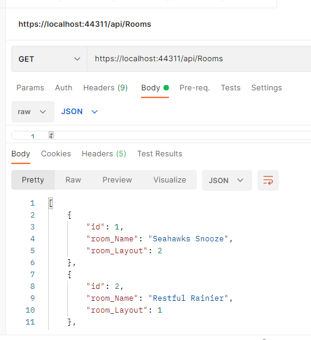
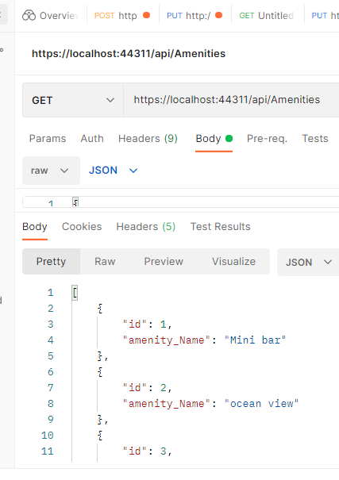

# Async-Inn
# Hotel Asset Management system
---

## Hanan Nathem Jalal Saadeh

# Lab 11 + 12
## 14/4/2022


# Description

This is a ASP.NET Core MVC web application that will allow Async Hotel to better manage the assets in their hotels. This application can modify and manage rooms, amenities, and new hotel locations. The data entered by the user will persist across a relational database and maintain its integrity as changes are made to the system.

- Ability to add Hotals by there ID, name, city, state, Address and phone Number.
- Ability to add rooms by there ID and name.
- Ability to add amenities by there ID and name
- Ability to get data from hotels table and Update or delete from the table.
- the same for rooms and amenities tables.

 

 Hotel Table :
 Fields: ID, Name, city, state, address, and finally the phone number.
Relation: One to many relation with Rooms Table.

Rooms Table :
Fields: ID, price, room number, pet friendly.
Relation : two forign key,one from room table, and the other from hotel table.

Room table:
Field: ID, nickname, layout.
Relation: one to many with rooms table, and with amenities table.

layout table :
Field: id, one bedroom, two bedrooms, studio.
Relation: one to many with room table.

amintity table :
Field : id,name.
Relation : one to many with amintities table.

AmantityRoomTable :
field : amantity id,roomid.compossite id 


# Getting Started
Clone this repository to your local machine.

$ git clone https://github.com/Hanan-Nathem-Saadeh/Async-Inn.git


# Lab 13

We took about Refactor our Controllers using Dependency Injection and a Repository:

- Build a Model Interface.
- Build a basic service.:
Created a service for each of the controllers that implement the appropriate interface.
- Database Logic: Create/Get All/Get One/Delete/Update
- Refactor the Controller: Constructor.
- CRUD Methods.
- Run the app.

**Confirmed in POSTMAN**


---


---


---




# Lab 14
## 24/4/2022
in this lab we took about Navigation Properties & Routing
and learnd about how build the join table between tables with many to many relations

- create HotelRoom class in models.
- Navigation property .
- connect Hotel class and Room class with HotelRoom class by adding
public List<HotelRoom> HotelRooms { get; set; } to both classes
- change tha data set.
- create forign key to the join table.
- create interface with CRUD Methods.
- Creat the Service inherit the interface.
- Add to your IRoom Interface the method signatures to => AddAmenityToRoom and RemoveAmentityFromRoom

# Endpoints:(Routing)

- Routs for Hoteles

```
GET: api/Hotels => To Get a list of all hotels.
GET: api/Hotels/{id} =>  Get a hotel by ID.
PUT: api/Hotels/{id} =>  Update a hotel by ID.
POST: api/Hotels => Create a new hotel.
DELETE: api/Hotels/{id} => Delete a hotel bu ID.
```

--- 

- Routs for Rooms 

```
GET: api/Rooms =>  Get a list of all rooms.
GET: api/Rooms/{id} => Get a room by ID.
PUT: api/Rooms/{id} => Update a room by ID.
POST: api/Rooms => Create a new room.
POST: {roomId}/{amenityId} => Add an amenity to a room.
DELETE: {roomId}/{amenityId} => Delete an amenity from a room.
DELETE: {roomId} => Delete a room.
```

---

- Routs for Amentities

```
GET: api/Amenities => Get a list of all amenities
GET: api/Amenities/{id} => Get an amenity by ID
PUT: api/Amenities/{id} => Update an amenity by ID
POST: api/Amenities => Create a new amenity
DELETE: api/Amenities/{id} => Delete an amenity by ID
```

---

- Routs for HotelRoom

```
GET: api/HotelRooms/{hotelId}/Rooms => Get a list of all hotelRooms
GET: api/HotelRooms/{hotelId}/Rooms/{roomNumber} => Get a hotelRooms by ID
PUT:  api/HotelRooms/{hotelId}/Rooms/{roomNumber} => Update a hotelRooms by ID
POST: api/HotelRooms/"{hotelId}/Rooms => Create a new hotelRooms
DELETE: api/HotelRooms/{hotelId}/Rooms/{roomNumber} => Delete a hotelRooms

```
# Lab 16
## 28/4/2022

- Data Transfer Objects (DTOs)
Add onto My current Async Inn application by cleaning up input and outputs of your controllers to be DTOs.

- modify the controllers/Interfaces and The Servicies
- Mu DTOs

```

Create DTOs that will be accepted and returned to the user:

    public class HotelDTO
    {
        public int ID { get; set; }
        public string Name { get; set; }
        public string StreetAddress { get; set; }
        public string City { get; set; }
        public string State { get; set; }
        public string Phone { get; set; }
        public List<HotelRoomDTO> Rooms { get; set; }
    }


    public class HotelRoomDTO
    {
        public int HotelID { get; set; }
        public int RoomNumber { get; set; }
        public decimal Rate { get; set; }
        public bool PetFriendly { get; set; }
        public int RoomID { get; set; }
        public RoomDTO Room { get; set; }
    }

    public class RoomDTO
    {
        public int ID { get; set; }
        public string Name { get; set; }
        public string Layout { get; set; }
        public List<AmenityDTO> Amenities { get; set; }
    }

    public class AmenityDTO
    {
        public int ID { get; set; }
        public string Name { get; set; }
    }

```


