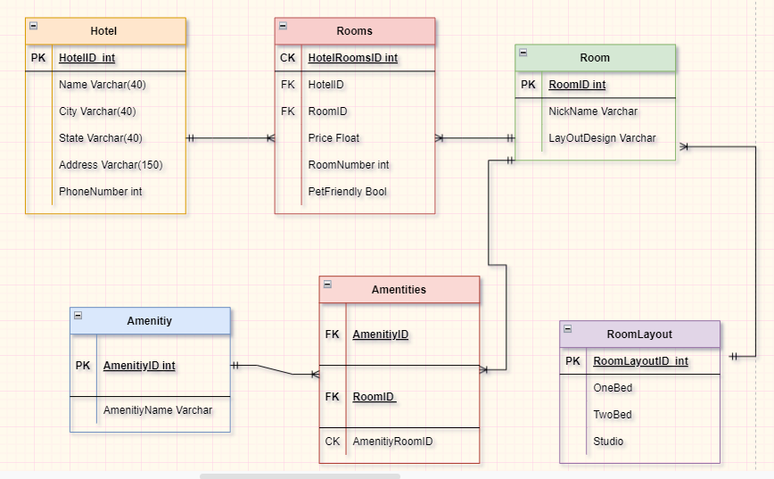

# Async-Inn

## Hanan Nathem Jalal Saadeh

## 14/4/2022

# Hotel Asset Management system
# Description

This is a ASP.NET Core MVC web application that will allow Async Hotel to better manage the assets in their hotels. This application can modify and manage rooms, amenities, and new hotel locations. The data entered by the user will persist across a relational database and maintain its integrity as changes are made to the system.

- Ability to add Hotals by there ID, name, city, state, Address and phone Number.
- Ability to add rooms by there ID and name.
- Ability to add amenities by there ID and name
- Ability to get data from hotels table and Update or delete from the table.
- the same for rooms and amenities tables.

# Getting Started
Clone this repository to your local machine.

$ git clone https://github.com/Hanan-Nathem-Saadeh/Async-Inn.git

---

---

---

Hotel Table :
 Fields: ID, Name, city, state, address, and finally the phone number.
Relation: One to many relation with Rooms Table.

Rooms Table :
Fields: ID, price, room number, pet friendly.
Relation : two forign key,one from room table, and the other from hotel table.

Room table:
Field: ID, nickname, layout.
Relation: one to many with rooms table, and with amenities table.

layout table :
Field: id, one bedroom, two bedrooms, studio.
Relation: one to many with room table.

amintity table :
Field : id,name.
Relation : one to many with amintities table.

AmantityRoomTable :
field : amantity id,roomid.compossite id 
